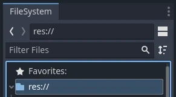
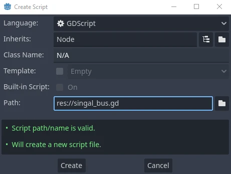
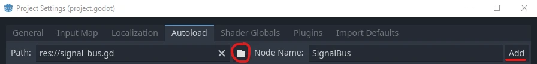

<!-- Gets the meta data og:title.  -->
# Using Signals Between Scenes in Godot 4

Tested with <Badge type="tip" text="Godot 4.1.1" /> <Badge type="tip" text="GDScript" />

In Godot, using signals within a single scene is fairly straightforward since you have easy access to all the nodes in that scene.

However, what do you do when you want to emit a signal from a scene (or many) and then listen for that signal in a totally different scene (or many)?

There are multiple ways to do this. However, this short tutorial will focus on implementing a pattern often called an *EventBus*. This method relies on a global, autoloaded object (a singleton), which is where we'll define our signals. We'll call this global object a `SignalBus` and it will allow us to use and re-use signals between scenes.

## Example Use Case
A common need is to have the ability to **toggle a settings menu's visibility** from a number of different places in a codebase. The following examples are written with this use case in mind.

## Create A New Script
In your `FileSystem`, right-click and `Create New` > `Script`. You can put this script anywhere in `res://`.



Name this new script `signal_bus.gd`.



## Enable Autoload
Go to `Project` > `Project Settings` > `Autoload`. 

Click on the folder icon (circled in red) and then find and open your script `signal_bus.gd`. This will automatically generate the node name, `SignalBus`. Leave it as is and click `Add`.



## Define Global Signals
Inside `signal_bus.gd`, define a signal called `toggle_settings_ui`. 

```gdscript
# signal_bus.gd
extends Node

signal toggle_settings_ui
# ... add any other signals you may want.
```

### Connect
From any scene in your project, you can `connect` to any signal in `SignalBus`.
```gdscript
SignalBus.toggle_settings_ui.connect(<some function to trigger>)
```

#### Example
In the following theoretical example, I have a scene called `settings_ui.tscn` with an attached script called `settings_ui.gd`. This script is how the settings menu visibility actually gets toggled and therefore is where we will listen for the `toggle_settings_ui` signal. 

Inside `_ready()`, we can connect the `toggle_settings_ui` signal to the `toggle()` function. 

```gdscript
# settings_ui.gd (attached to settings_ui.tscn)
# ...

func _ready():
	# Only connect the signal if it isn't already connected.
	if !SignalBus.is_connected("toggle_settings_ui", toggle):
		SignalBus.toggle_settings_ui.connect(toggle) // [!code focus]

func toggle():
	# ... the logic to show/hide the settings menu scene.
```

### Emit
From any scene in your project, you can `emit` any signal in `SignalBus`.

```gdscript
SignalBus.toggle_settings_ui.emit()
```

#### Example
This is where things get really interesting. Thanks to our new `SignalBus`, we can now easily toggle the settings menu visibility, even from very different and disconnected scenes. Here are a couple of examples.

```gdscript
# From inside a main menu scene, submenu scene, or wherever.

# Toggle settings menu on UI button pressed.
func _on_settings_button_pressed():
	SignalBus.toggle_settings_ui.emit()
```

```gdscript
# From inside a main scene, player scene, or wherever.

# Toggle settings menu when ESC key is pressed.
if Input.is_action_just_pressed("quit"):
	SignalBus.toggle_settings_ui.emit()
```

## Conclusion
There are always pros and cons to any design pattern and this one is no different. In large and complex projects, it can quickly become difficult to keep track of many global signals firing all throughout a codebase (but not impossible). All projects are different and this is just another tool you now have in your toolbox. 

I hope you found this article helpful and thanks for reading!

## Additional Resources
- [Godot - Using Signals](https://docs.godotengine.org/en/stable/getting_started/step_by_step/signals.html)
- [Godot - Signal Class](https://docs.godotengine.org/en/stable/classes/class_signal.html)
- [Observer Pattern](https://gameprogrammingpatterns.com/observer.html)
- [Godot - Autoloads](https://docs.godotengine.org/en/stable/tutorials/scripting/singletons_autoload.html)
