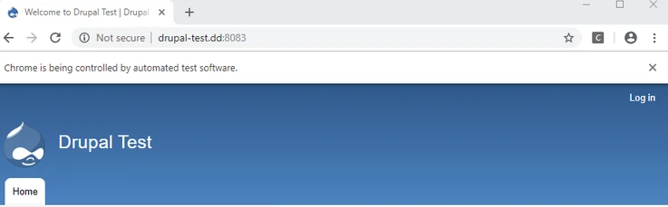
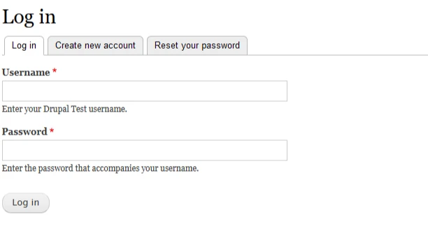
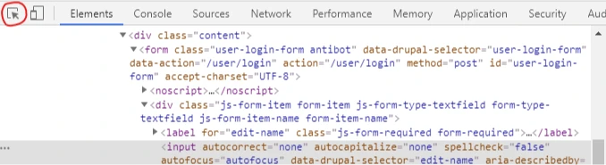
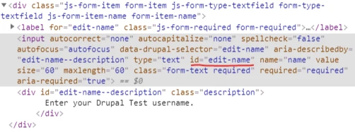
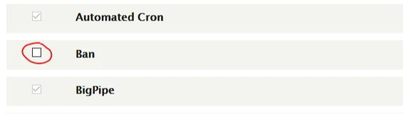

# Automating Website Logins & Maintenance with Selenium for Python

Tested with <Badge type="tip" text="Python 3.6" />

::: tip HEADS UP
This article was originally written in 2019 and may be outdated. It's currently under review.
:::

## Web Automation
You can use the [Selenium WebDriver](https://www.seleniumhq.org/projects/webdriver/) framework to access websites programmatically. You'll learn how to use Selenium to login to a website (plus avoid bot detection!), navigate to a new page, check a checkbox, and then save the change. 

I'll be using a local [Drupal](https://www.drupal.org/) (CMS) install as a demo, but this code will work on any website, just change the relevant values for your project. This code has been tested with Python 3.6. 

Now, let's learn some web automation techniques.  

## High-level Overview
Here's a high-level overview of what we'll accomplish in this article.
- Create a Python virtual environment
- Open a Chrome browser window controlled by the script
- Login to a site
- Avoid bot detection to complete the login
- Enable a module (check a checkbox and click a button)
- Generate a requirements.txt file so others can easily run your program

## Create a Python Virtual Environment
When creating Python programs it's good practice to encapsulate your projects in what's called a virtual environment. We'll use one simple command to generate a folder in the root of your project that will hold everything your Python program needs to run. When created, this folder will contain a binary of Python that's the same as the binary used to create it. Any packages you ```pip install``` will get added to this folder and not to your global system, keeping things clean. 

Open up your terminal. 

::: tip HEADS UP
The ```$``` denotes the command line itself. Commands you type will follow it.
:::

### Check Python version

```bash
$ python -V
```

::: tip HEADS UP
On Linux you may need to run this command.
:::

```bash
$ python3 -V
```

If so, anytime ```python``` is used in a command, be sure to use ```python3``` instead. 

Navigate to the folder you want this project to live in.

If you're on Python 2.x the following command will not work for you. I suggest using Python 3.3+ but if not, look for another virtual environment solution like [virtualenv](https://virtualenv.pypa.io/en/latest/) for Python 2/3. 

Let's create a virtual environment for this Python 3 project. I'm using version 3.6.

```bash
$ python -m venv venv
```

This will create a new folder in your project called "venv". The command may be confusing at first, but the first ```venv``` is the virtual environment command and the second is the name of the virtual environment (it could be anything). The commands below assume you have named your virtual environment "venv".

### Activate virtual environment

Just because we ran the command above does **not** mean we get the benefits of a virtual environment. We will need to activate it first. 

::: tip HEADS UP
See the differences for Windows and Linux below.
:::

Run this command to activate your virtual environment. 

#### Windows
```bash
$ venv\Scripts\activate
```

#### Linux
```bash
$ source venv\bin\activate
```

You should see this in your terminal now:
```bash
(venv) $ 
```

Now that the virtual environment is activated, anytime we ```pip install``` something, the package will get installed inside our ```/venv``` folder. We'll also be able to easily generate a ```requirements.txt``` file so anyone else (or our future self) can easily replicate the exact dependencies of this project in another virtual environment. We'll go over this at the end.

## Create a New File
Create a new file in your project root called ```login.py```. This will be the only file that you will need to create for this project. 

## Install Selenium
[Selenium](https://www.seleniumhq.org/) is a browser automation tool available in multiple programming languages. We'll be using the Python version. Remember, your virtual environment should be activated!

```bash
(venv) $ pip install selenium
```

## Setup your WebDriver
In your ```login.py``` file make these additions.

```python
from selenium import webdriver

driver = webdriver.Chrome("")
```

In order for Selenium to know what web driver (browser) we want, we need to provide a file path to a separate program on our computer. We'll be using ChromeDriver but there are [drivers available](https://www.seleniumhq.org/download/) for the other browsers as well. 

Download the [ChromeDriver](https://chromedriver.chromium.org/downloads) version that is compatible with your system. 

::: tip HEADS UP
You will need to have Google Chrome already installed and need to make sure your version of Google Chrome matches the version of ChromeDriver. 
:::

The download will give you a ```.zip``` file with an executable program inside. Unzip the file. Place the program somewhere that makes sense on your machine. I'm on Windows and I put my program here ```E:/programs/chromedriver/chromedriver.exe```. 

Now update your code in ```login.py``` to reflect the path to the ChromeDriver program.

```python
from selenium import webdriver

driver = webdriver.Chrome("E:/programs/chromedriver/chromedriver.exe")
```

::: tip HEADS UP
For **Windows**, make sure to change the slashes in the path to the ChromeDriver from using back slashes `\` to forward slashes `/`.
:::

::: tip HEADS UP
Any computer you try to run this program on will need to have a browser driver installed and it's path configured in the program. 
:::

## Create Login Function
Let's create a function to house the site login logic. This function will take a base URL as a parameter. I'm using a locally running Drupal install, but you can use this on any site, just change the relevant values. 

First, we'll test to make sure our ChromeDriver works and that we can navigate to the homepage. 

Here is the full program so far. Read the comments for more info. 

```python
from selenium import webdriver

driver = webdriver.Chrome("E:/programs/chromedriver/chromedriver.exe")

# Site login function
def site_login(base_url):

  # Navigate to URL with our browser
  driver.get(base_url)

# The base URL of the site
url = "http://drupal-test.dd:8083"

# Call our login function and pass in our URL
site_login(url)
```

Now let's run it.

```bash
(venv) $ python login.py
```

You should see a new Chrome window open up! You'll also see a note that Chrome is being controlled by automated software. Nice. 



Now you can manually close the new Chrome window. Each time the program is run, a new window will pop up. 

### Go to login page

Let's now go directly to the login page. Here is where things get interesting. In Drupal the admin login page is located at ```/user/login```. Change your path accordingly. We'll concatenate this to our ```base_url```. 

```python
# Navigate to URL with our browser
driver.get(base_url + "/user/login")
```

When you rerun your program you should now see the login page. If you do not, make sure that the URL in the new browser that opened up is correct. It is a common mistake to have multiple forward slashes `//` in a row. Check the address bar in your browser.



### Find the username and password fields
Now we want to have the program enter our username and password for us. We can use Selenium to locate the correct input field and then send keyboard presses to that field. First, we need to find a unique identifier for that field. Let's open up our browser's development tools. 

On Chrome, you can right-click and press "Inspect".

Once you have the inspector open, click the icon circled in red (Chrome) and hover over the username field and click inside it. 



Once you do this, the HTML code that makes up the username field will be highlighted in the "Elements" display panel of the development tools. 



You can see I underlined the ```id``` of the username input field, which is equal to ```edit-name``` in this case. This will be our unique identifier for the username input field. We can use the ```id``` of the password field for its unique identifier, which is ```edit-pass```. 

This is effective because a valid HTML page should only include unique ids that appear only once. Your mileage may vary on your site. There are many other ways to [locate elements](https://selenium-python.readthedocs.io/locating-elements.html) using Selenium. 

Add the following to your ```site_login()``` function.

```python
# Site login function
def site_login(base_url):

  # Navigate to URL with our browser
  driver.get(base_url + "/user/login")

  # Find the username and password elements by id
  username = driver.find_element_by_id("edit-name")
  password = driver.find_element_by_id("edit-pass")
```

You should be able to run your program again with no errors. 

::: tip HEADS UP
There are many other ways to [locate elements](https://selenium-python.readthedocs.io/locating-elements.html) using Selenium.
:::

### Enter username, password, and click submit 
In order for Selenium to send key presses to the inputs, we can use the ```send_keys()``` method. Then we'll use the ```click()``` method to submit the form.

We'll add the following to our ```site_login()``` function.

```python
# Enter username and password into fields
username.send_keys("admin")
password.send_keys("admin")
```

In this case, my username and password is "admin". 

::: danger 
It's not safe to use passwords directly in your source code. This is for example purposes only. You can use the Python library .ENV ([dotenv](https://pypi.org/project/python-dotenv/)) to load usernames/passwords etc. from environment variables. Stay safe out there. 
:::

If we run our program again, we can see that the username and password fields get filled out! Now we just need to click the "Log In" button. We have a very similar method of finding the element as we did with the input fields. 

First, let's find the "Log In" button by ```id```. In my case the ```id``` is ```edit-submit```. Let's prepare to submit the form.

Add the following to our ```site_login()``` function.

```python
# Find the submit button by id
submit = driver.find_element_by_id("edit-submit")
```

Now let's click the button! 

```python
# Click the submit button
submit.click()
```

Rerun the program to see if it logs you in automatically. 

Here is the full program so far.

```python
from selenium import webdriver

driver = webdriver.Chrome("E:/programs/chromedriver/chromedriver.exe")

# Site login function
def site_login(base_url):

  # Navigate to URL with our browser
  driver.get(base_url + "/user/login")

  # Find the username and password elements by id
  username = driver.find_element_by_id("edit-name")
  password = driver.find_element_by_id("edit-pass")

  # Enter username and password into fields
  username.send_keys("admin")
  password.send_keys("admin")

  # Find the submit button by id
  submit = driver.find_element_by_id("edit-submit")

  # Click the submit button
  submit.click()

# The base URL of the site
url = "http://drupal-test.dd:8083"

# Call our login function and pass in our URL
site_login(url)
```

Did your login work? Most sites will have allowed you to login. However, you may run into the case where you get denied access because of a site's bot protection. In my case, the [Antibot](https://www.drupal.org/project/antibot) module for Drupal is installed on my site. This is great to have in production and does help prevent bots, but as you will see, it's easy to fool. 

Aside from making sure the user has Javascript enabled, here is what Antibot checks.
> After the page is loaded, Antibot, using JavaScript, waits for a mouse to move, an enter or tab key to be pressed, or a mobile swipe gesture before the action of the form is switched back to the path that it was originally set to be. This indicates that the person behind the controls is a human and not a robot.
> 
> -- Antibot

*Muhahaha!* Let's see what we can do about that. In fact, we can simulate a mouse move to get around this particular bot prevention technique. We will need to import something called `ActionChains`. Add this to your list of imports.

```python
from selenium.webdriver.common.action_chains import ActionChains
```

Now, we can run this any time after we request the page. But, I'll put this in right before we send the keys in our ```site_login()``` function.

```python
# Simulate mouse move to get by bot protection
ActionChains(driver).move_to_element(username).perform()
```

We attach our ```driver``` to ```ActionChains()``` and call the ```move_to_element()``` method. We pass in ```username``` and this moves our mouse to the element that is saved in the ```username``` variable, in this case our username input field. We don't need to move the mouse specifically there, but it was easy to set up. We can also move the mouse by x/y coordinates. Then we execute our action chain with ```.perform()```. 

There are a lot of other things you can simulate with [ActionChains](https://selenium-python.readthedocs.io/api.html#module-selenium.webdriver.common.action_chains) including more advanced interaction like drag-and-drop. 

Here is our full program so far. We can rerun the program and it should login successfully, getting by the Antibot protections. Look into your site's bot protection to see what specifically you need to do (if anything). 

```python
from selenium import webdriver
from selenium.webdriver.common.action_chains import ActionChains

driver = webdriver.Chrome("E:/programs/chromedriver/chromedriver.exe")

# Site login function
def site_login(base_url):

  # Navigate to URL with our browser
  driver.get(base_url + "/user/login")

  # Find the username and password elements by id
  username = driver.find_element_by_id("edit-name")
  password = driver.find_element_by_id("edit-pass")

  # Simulate mouse move to get by bot protection
  ActionChains(driver).move_to_element(username).perform()

  # Enter username and password into fields
  username.send_keys("admin")
  password.send_keys("admin")

  # Find the submit button by id
  submit = driver.find_element_by_id("edit-submit")

  # Click the submit button
  submit.click()

# The base URL of the site
url = "http://drupal-test.dd:8083"

# Call our login function and pass in our URL
site_login(url)
```

## Enable a Module (Check a checkbox)
Now, we have a pretty reliable way to login to our site via Python, which is pretty cool. But, we want to actually do some useful administrative tasks with this power. 

As a basic example, we'll enable a module in Drupal which involves checking a checkbox and then clicking the "Install" button. 

Let's create a new function called ```enable_module()```. The first thing we need to do is get the page the modules are on. For Drupal this page is "/admin/modules". So we'll navigate there first. 

```python
# Check and install module
def enable_module(base_url):

  # Navigate to URL with our browser
  driver.get(base_url + "/admin/modules")
```

If we re-run the program, we'll never navigate to this page because we haven't called this function yet. Let's call this function after the ```site_login()``` function. 

```python
# Call our enable module function and pass in our URL
enable_module(url)
```

::: tip HEADS UP
You could design this a lot of ways. One thing you would want to check is that the login is successful and if so, then call the ```enable_module()``` function. But I'll let you be creative! We'll keep it simple for now. 
:::

Here is what our full program looks like now.

```python
from selenium import webdriver
from selenium.webdriver.common.action_chains import ActionChains

driver = webdriver.Chrome("E:/programs/chromedriver/chromedriver.exe")

# Site login function
def site_login(base_url):

  # Navigate to URL with our browser
  driver.get(base_url + "/user/login")

  # Find the username and password elements by id
  username = driver.find_element_by_id("edit-name")
  password = driver.find_element_by_id("edit-pass")

  # Simulate mouse move to get by bot protection
  ActionChains(driver).move_to_element(username).perform()

  # Enter username and password into fields
  username.send_keys("admin")
  password.send_keys("admin")

  # Find the submit button by id
  submit = driver.find_element_by_id("edit-submit")

  # Click the submit button
  submit.click()

# Check and install module
def enable_module(base_url):

  # Navigate to URL with our browser
  driver.get(base_url + "/admin/modules")


# The base URL of the site
url = "http://drupal-test.dd:8083"

# Call our login function and pass in our URL
site_login(url)

# Call our enable module function and pass in our URL
enable_module(url)
```

So, now if we run the program we get logged in and then navigated to the modules page. Let's build out the rest of the ```enable_module()``` function. You'll see it's not much different than how we logged in.

We'll want to use our HTML inspector again to locate the ```id``` of the checkbox we want to check. In this case, I want to enable the "Ban" module because it's time to bring down the ban hammer. 



The ```id``` of the checkbox in my case is ```edit-modules-ban-enable```. You may not have such a convenient ```id```. Thanks Drupal. But remember, you have many options with Selenium to locate elements by other means. 

Let's add this to our ```enable_module()``` function.

```python
# Find checkbox by id
checkbox = driver.find_element_by_id("edit-modules-ban-enable")
```

We want to check if the box is already checked, just in case. Let's add this below our previous line of code. If the checkbox is already selected, we'll print a message to the console. If not, we'll click the checkbox.

```python
# Check if checkbox is already selected, if not click it
if (checkbox.is_selected()):
  print("Checkbox is already selected!")
else: 
  checkbox.click()
```

If we run the program right now, you'll notice the checkbox will get a checkmark!

Now that we have the module checked that we want to install, we need to click the "Install" button at the bottom of the page. You'll notice a pattern, if you haven't already. We'll get the ```id``` of the button and then click it. 

We should add some checking here to see if the checkbox got checked and if anything new actually needs installed, but for now, the install button code will run every time. 

Add this code to the ```enable_module()``` function.

```python
# Find the install button by id
install = driver.find_element_by_id("edit-submit")

# Click install
install.click()
```

After we run our program now, the module should get installed! 

## Selenium Cleanup
Our program works, but our bot-controlled browser stays open. We can easily close it when we're done by adding the following at the bottom of our program.

```python
# Close the browser window
driver.quit()
```

Here is our final ```login.py``` program.

```python
from selenium import webdriver
from selenium.webdriver.common.action_chains import ActionChains

driver = webdriver.Chrome("E:/programs/chromedriver/chromedriver.exe")

# Site login function
def site_login(base_url):

  # Navigate to URL with our browser
  driver.get(base_url + "/user/login")

  # Find the username and password elements by id
  username = driver.find_element_by_id("edit-name")
  password = driver.find_element_by_id("edit-pass")

  # Simulate mouse move to get by bot protection
  ActionChains(driver).move_to_element(username).perform()

  # Enter username and password into fields
  username.send_keys("admin")
  password.send_keys("admin")

  # Find the submit button by id
  submit = driver.find_element_by_id("edit-submit")

  # Click the submit button
  submit.click()

# Check and install module
def enable_module(base_url):

  # Navigate to URL with our browser
  driver.get(base_url + "/admin/modules")

  # Find checkbox by id
  checkbox = driver.find_element_by_id("edit-modules-ban-enable")

  # Check if checkbox is already selected, if not click it
  if (checkbox.is_selected()):
    print("Checkbox is already selected!")
  else: 
    checkbox.click()

  # Find the install button by id
  install = driver.find_element_by_id("edit-submit")

  # Click install
  install.click()

# The base URL of the site
url = "http://drupal-test.dd:8083"

# Call our login function and pass in our URL
site_login(url)

# Call our enable module function and pass in our URL
enable_module(url)

# Close the browser window
driver.quit()
```

## Generate Project Dependencies

It'd be nice to get a list of all the Python packages that this project relies on. We can do that with the following ```pip``` command.

```bash
(venv) pip freeze > requirements.txt
```

You'll notice this creates a new file in the root of your project called ```requirements.txt```. This file has all the packages this project relies on. 

In the ```requirements.txt``` file you should see something like this.

```text
selenium==3.141.0
urllib3==1.25.6
```

## Install Project Dependencies

If you'd like to install these dependencies with one command in a new project that has a freshly activated virtual environment, run the following command.

```bash
(venv) $ pip install -r requirements.txt
```

This will install all of the packages in your new ```/venv``` folder. The ```-r``` flag stands for *recursive*. Without this, only the first package would get installed. 

## Deactivate Virtual Environment
If you'd like to deactivate your virtual environment, run the following command:

```bash
(venv) $ deactivate
```

```bash
$
```

You'll see you command prompt return to normal. You're now back in the global context of your machine.

## Wrap Up
I hope this article has given you a glimpse into the power of Selenium, Python, and browser automation! This was a rather trivial example, but you should have enough to get you going for your own website automation and testing tasks! Read more about [Selenium Python](https://selenium-python.readthedocs.io/index.html) to see what else is possible.